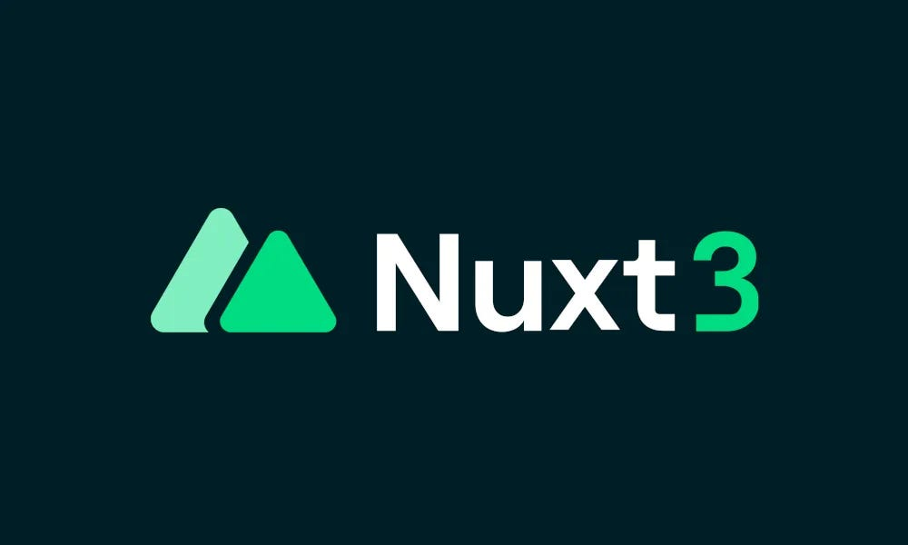

# English Vocabulary

This is a simple English dictionary built as a didactic project using Vue 3 and Nuxt 3.



## See it working

https://my-english-vocabulary.netlify.app/

## Setup

Make sure to install the dependencies:

```bash
# npm
npm install

# pnpm
pnpm install

# yarn
yarn install

# bun
bun install
```

## Development Server

Start the development server on `http://localhost:3000`:

```bash
# npm
npm run dev

# pnpm
pnpm run dev

# yarn
yarn dev

# bun
bun run dev
```

## Production

Build the application for production:

```bash
# npm
npm run build

# pnpm
pnpm run build

# yarn
yarn build

# bun
bun run build
```

Locally preview production build:

```bash
# npm
npm run preview

# pnpm
pnpm run preview

# yarn
yarn preview

# bun
bun run preview
```

## About

This project was developed to practice and demonstrate the use of Nuxt 3 as a simple dictionary application. It allows users to add and search for terms along with their translations, examples, and pronunciations.

For more details, check out the [Nuxt 3 documentation](https://nuxt.com/docs/getting-started/introduction).
